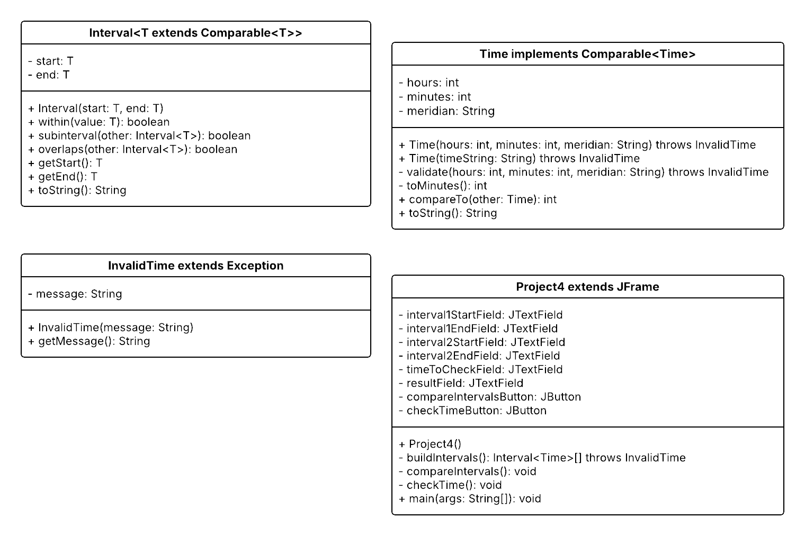
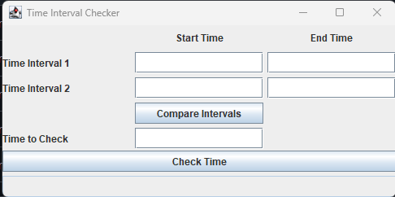
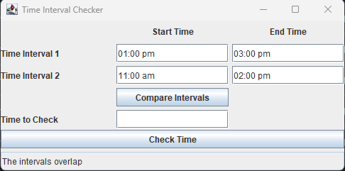
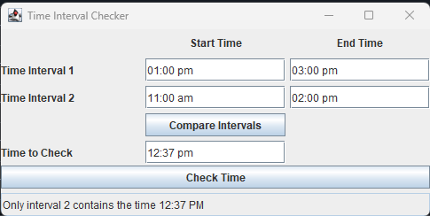
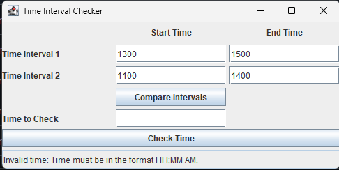

# Java Time Interval Checker

---

A Java Swing desktop application that compares time intervals, validates user input, and determines interval relationships using object-oriented programming principles, generic classes, and immutable objects.


## Overview

---
This project demonstrates object-oriented software design by implementing a graphical desktop application capable of comparing time intervals and validating time input. The application was built using Java Swing and emphasizes reusable design through generic programming, immutable objects, custom exceptions, and comprehensive input validation.

## Features

---
- Compare two time intervals
- Detect overlapping intervals
- Detect sub-interval relationships
- Detect disjoint intervals
- Determine whether a specific time falls within one or both intervals
- Comprehensive input validation
- Custom checked exceptions
- Graphical user interface built with Java Swing

## Object-Oriented Design

---
This project demonstrates several core object-oriented programming concepts:

- Generic classes (`Interval<T>`)
- Immutable objects
- Encapsulation
- Comparable interface
- Custom checked exceptions
- Separation of responsibilities across multiple classes

## UML Design

---
The application's class relationships are illustrated below.




## Technologies

---
- Java
- Java Swing
- Object-Oriented Programming
- Generics
- Git

## Screenshots

---
### Main Application



### Interval Comparison



### Time Validation



### Invalid Input Handling



## Testing

---
The application was tested against a variety of valid and invalid input scenarios.

### Test Scenarios

- Overlapping intervals
- Sub-interval detection
- Disjoint intervals
- Invalid hour values
- Invalid minute values
- Invalid meridian values
- Non-numeric input
- Start time occurring after end time

## Installation

---
Clone the repository:

```bash
git clone https://github.com/jcrosbybuilds/java-time-interval-checker.git
```

Open the project in IntelliJ IDEA (or another Java IDE).

Compile and run:

```
Project4.java
```

## Project Structure

---
```text
java-time-interval-checker/
├── src/
│   ├── Interval.java
│   ├── Time.java
│   ├── InvalidTime.java
│   └── Project4.java
├── screenshots/
├── README.md
├── LICENSE
└── .gitignore
```

## What I Learned

---
This project strengthened my understanding of:

- Generic programming in Java
- Immutable class design
- Object-oriented software architecture
- Java Swing GUI development
- Exception handling
- Input validation
- Comparable interface
- Git and GitHub project management

## Future Improvements

---
Potential enhancements include:

- Calendar date support
- Drag-and-drop scheduling
- Save and load interval data
- Unit testing with JUnit
- Maven or Gradle build support
- Dark mode interface